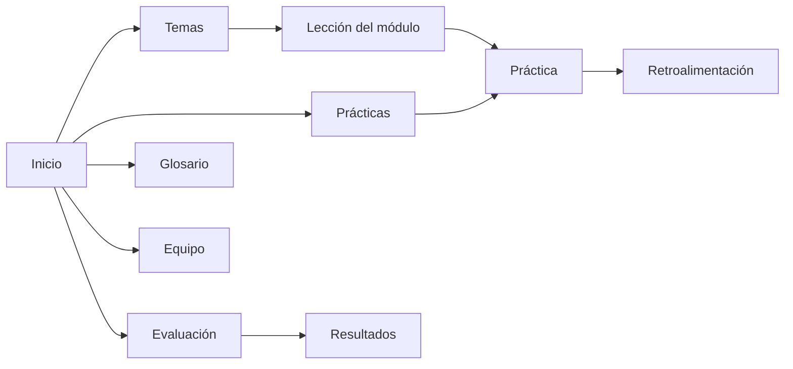

# 03 · Navegación y bosquejos de baja fidelidad

## Mapa de navegación



**Justificación:** el recorrido principal es *Inicio → Temas → Lección → Práctica → Evaluación*. La barra superior siempre permite volver a cualquier sección.

## Pantalla 1 · Inicio

```
┌──────────────────────────────────────────────────────┐
│ AulaLógica   Inicio | Temas | Prácticas | Evaluación │
├──────────────────────────────────────────────────────┤
│           APRENDE LÓGICA PASO A PASO                 │
│   Explicaciones breves, ejemplos y práctica          │
│                  [ COMENZAR ]                        │
├──────────────────────────────────────────────────────┤
│ ① Aprende → ② Mira el ejemplo → ③ Practica → ④ Evalúa│
├──────────────────────────────────────────────────────┤
│ Glosario · Equipo · Créditos                         │
└──────────────────────────────────────────────────────┘
```

## Pantalla 2 · Listado de temas

```
┌──────────────────────────────────────────────────────┐
│ [Barra de navegación]                                │
├──────────────────────────────────────────────────────┤
│ Módulos de aprendizaje                               │
│ ┌─────────────┐ ┌─────────────┐ ┌─────────────┐      │
│ │1 Algoritmos │ │2 Pseudocód. │ │3 Java básico│      │
│ │ [Explorar]  │ │ [Explorar]  │ │ [Explorar]  │      │
│ └─────────────┘ └─────────────┘ └─────────────┘      │
│ ┌─────────────┐ ┌─────────────┐ ┌─────────────┐      │
│ │4 Condicion. │ │5 Ciclos     │ │6 Validación │      │
│ │ [Explorar]  │ │ [Explorar]  │ │ [Explorar]  │      │
│ └─────────────┘ └─────────────┘ └─────────────┘      │
└──────────────────────────────────────────────────────┘
```

## Pantalla 3 · Lección

```
┌──────────────────────────────────────────────────────┐
│ [Barra de navegación]                                │
├──────────────────────────────────────────────────────┤
│ Módulo 4 · Condicionales                             │
│ ▸ Explicación breve                                  │
│ ▸ Ejemplo resuelto (entrada → proceso → salida)      │
│ ▸ Fragmento de código Java                           │
│ [ ◄ Anterior ]              [ Ir a la práctica ► ]   │
└──────────────────────────────────────────────────────┘
```

## Pantalla 4 · Práctica interactiva

```
┌──────────────────────────────────────────────────────┐
│ [Barra de navegación]                                │
├──────────────────────────────────────────────────────┤
│ Práctica: ¿Aprueba o reprueba?                       │
│ Nota (0–10): [ ______ ]   [ PROBAR CON JAVA ]       │
├──────────────────────────────────────────────────────┤
│ Retroalimentación                                    │
│  ✔ Resultado: Aprobado                               │
│  ℹ Se ejecutó la rama "nota >= 7" porque...          │
│  ✖ Error: "Ingrese un número entre 0 y 10"          │
└──────────────────────────────────────────────────────┘
```

## Pantalla 5 · Evaluación y resultados

```
┌──────────────────────────────────────────────────────┐
│ [Barra de navegación]                                │
├──────────────────────────────────────────────────────┤
│ Pregunta 3 de 10                                     │
│ ¿Qué ciclo se ejecuta al menos una vez?              │
│   ( ) for    ( ) while    ( ) do-while               │
│                     [ SIGUIENTE ]                    │
├──────────────────────────────────────────────────────┤
│ Resultado final: 8 / 10                              │
│ Revisión por pregunta con explicación                │
└──────────────────────────────────────────────────────┘
```

## Criterios de accesibilidad previstos (RF-09)

- Contraste suficiente entre texto y fondo.
- Todo campo de formulario con su `<label>`.
- Navegación completa por teclado.
- Mensajes de error claros junto al campo.
