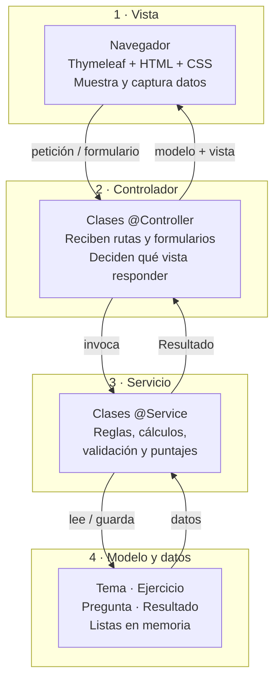
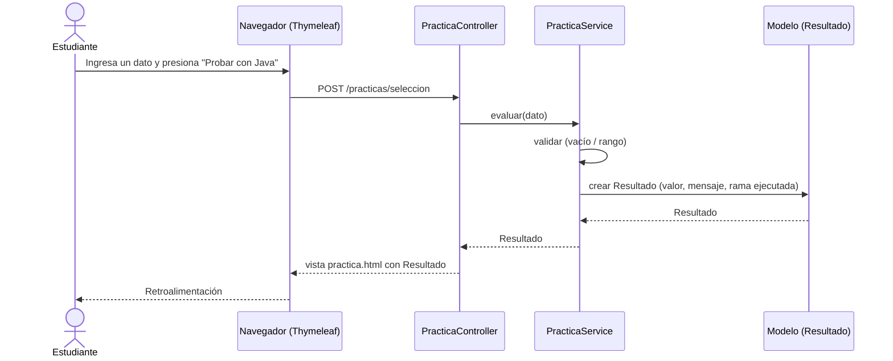

# 02 · Arquitectura MVC por capas

La arquitectura indica dónde vive cada responsabilidad y **debe coincidir** con las carpetas y clases del proyecto.

## Diagrama de capas



## Flujo de una práctica



## Responsabilidades

| Capa | Paquete / carpeta | Responsabilidad | No debe hacer |
|---|---|---|---|
| Vista | `resources/templates`, `static/css` | Mostrar contenido y capturar datos | Calcular o validar reglas |
| Controlador | `controller` | Recibir rutas y formularios, elegir vista | Contener lógica de negocio |
| Servicio | `service` | Validar, calcular, puntuar, explicar decisiones | Generar HTML |
| Modelo | `model` | Representar datos (Tema, Ejercicio, Pregunta, Resultado) | Depender de la web |

## Clases previstas

| Paquete | Clase | Función |
|---|---|---|
| `controller` | `InicioController` | Página de inicio y equipo |
| `controller` | `TemaController` | Listado de módulos y lecciones |
| `controller` | `PracticaController` | Formularios de las 3 prácticas |
| `controller` | `EvaluacionController` | Cuestionario y resultados |
| `service` | `TemaService` | Provee los 6 módulos y el glosario |
| `service` | `PracticaService` | Validación y cálculo de las prácticas |
| `service` | `EvaluacionService` | Corrección y puntaje |
| `model` | `Tema` | Título, explicación, ejemplo, código |
| `model` | `Ejercicio` | Enunciado, tipo, límites |
| `model` | `Pregunta` | Texto, opciones, respuesta correcta, explicación |
| `model` | `Resultado` | Valor, mensaje, rama ejecutada, éxito/error |

## Rutas

| Ruta | Método | Controlador | Vista |
|---|---|---|---|
| `/` | GET | InicioController | `inicio.html` |
| `/temas` | GET | TemaController | `temas.html` |
| `/temas/{id}` | GET | TemaController | `leccion.html` |
| `/practicas/{tipo}` | GET | PracticaController | `practica.html` |
| `/practicas/{tipo}` | POST | PracticaController | `practica.html` |
| `/evaluacion` | GET / POST | EvaluacionController | `evaluacion.html` / `resultado.html` |
| `/glosario` | GET | TemaController | `glosario.html` |
| `/equipo` | GET | InicioController | `equipo.html` |

## Estructura del proyecto

```
aulalogica-web/
├── src/main/java/ec/edu/uta/aulalogica/
│   ├── AulaLogicaApplication.java
│   ├── controller/
│   ├── service/
│   └── model/
├── src/main/resources/
│   ├── templates/        # inicio, temas, leccion, practica, evaluacion, resultado, glosario, equipo
│   ├── static/css/
│   ├── static/img/
│   └── application.properties
├── docs/
├── pom.xml
└── README.md
```

## Decisiones de diseño

| Decisión | Justificación |
|---|---|
| Spring Boot + Thymeleaf | Vistas del lado del servidor; la lógica se ejecuta realmente en Java |
| Datos en memoria | El alcance no exige base de datos; simplifica el proyecto |
| Servicios separados de controladores | Permite probar las reglas sin depender de la web |
| JavaScript opcional | La interactividad principal la aporta Java, no el navegador |
